# Velxio: Arduino & Embedded Board Emulator

**Live at [velxio.dev](https://velxio.dev)**

A fully local, open-source multi-board emulator. Write Arduino C++ or Python, compile it, and simulate it with real CPU emulation and 48+ interactive electronic components — all running in your browser.

**19 boards &middot; 5 CPU architectures**: AVR8 (ATmega / ATtiny), ARM Cortex-M0+ (RP2040), RISC-V RV32IMC/EC (ESP32-C3 / CH32V003), Xtensa LX6/LX7 (ESP32 / ESP32-S3 via QEMU), and ARM Cortex-A53 (Raspberry Pi 3 Linux via QEMU).


[](https://velxio.dev)
[](https://github.com/davidmonterocrespo24/velxio/pkgs/container/velxio)
[](https://github.com/davidmonterocrespo24/velxio/stargazers)
[](https://discord.gg/3mARjJrh4E)
[](LICENSE)
[](COMMERCIAL_LICENSE.md)

---

[](https://www.producthunt.com/products/velxio)

---

## Support the Project

Velxio is free and open-source. Building and maintaining a full multi-board emulator takes a lot of time — if it saves you time or you enjoy the project, sponsoring me directly helps keep development going.

| Platform | Link |
| --- | --- |
| **GitHub Sponsors** (preferred) | [github.com/sponsors/davidmonterocrespo24](https://github.com/sponsors/davidmonterocrespo24) |
| **PayPal** | [paypal.me/odoonext](https://paypal.me/odoonext) |

Your support helps cover server costs, library maintenance, and frees up time to add new boards, components, and features. Thank you!

---

## Try it now

**[https://velxio.dev](https://velxio.dev)** — no installation needed. Open the editor, write your sketch, and simulate directly in the browser.

To self-host with Docker (single command):

```bash
docker run -d -p 3080:80 ghcr.io/davidmonterocrespo24/velxio:master
```

Then open <http://localhost:3080>.

---

## Screenshots

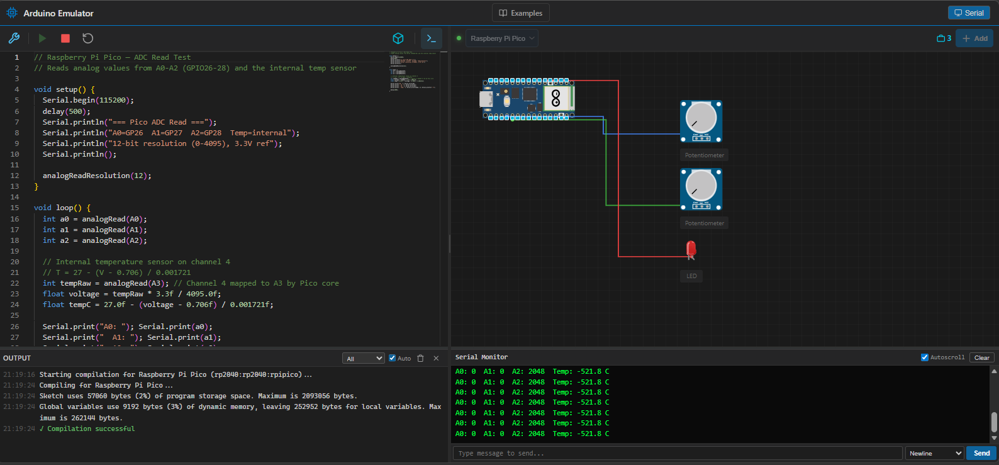

Raspberry Pi Pico simulation — ADC read test with two potentiometers, Serial Monitor showing live output, and compilation console at the bottom.

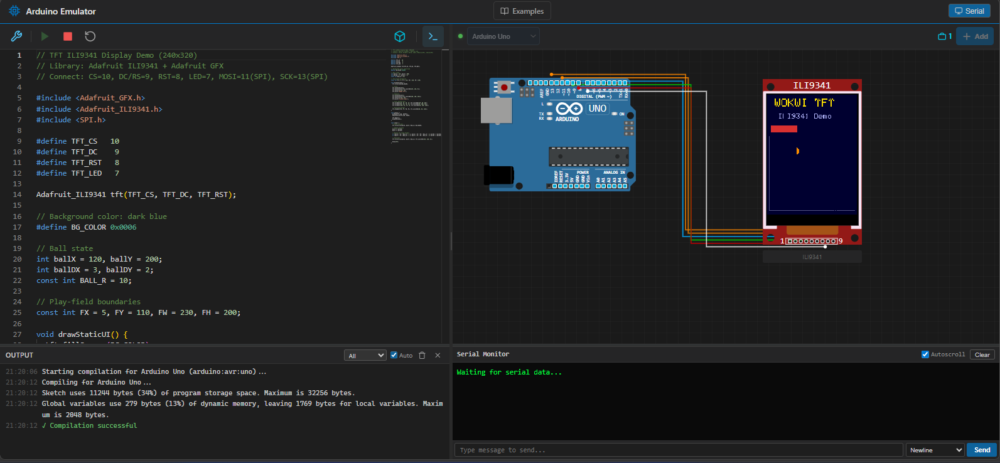

Arduino Uno driving an ILI9341 240×320 TFT display via SPI — rendering a real-time graphics demo using Adafruit_GFX + Adafruit_ILI9341.

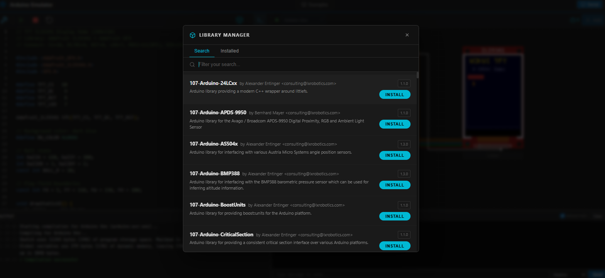

Library Manager loads the full Arduino library index on open — browse and install libraries without typing first.

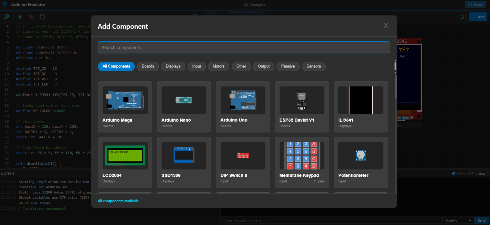

Component Picker showing 48 available components with visual previews, search, and category filters.

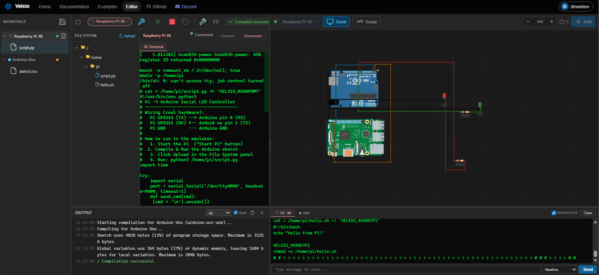

Multi-board simulation — Raspberry Pi 3 and Arduino running simultaneously on the same canvas, connected via serial. Mix different architectures in a single circuit.

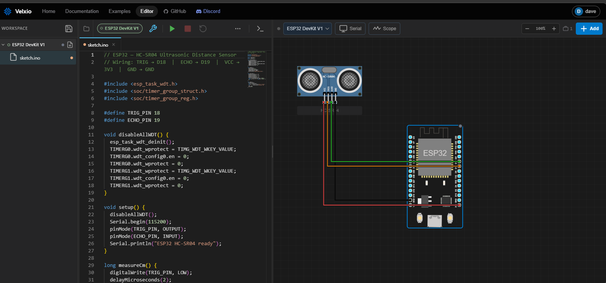

ESP32 simulation with an HC-SR04 ultrasonic distance sensor — real Xtensa emulation via QEMU with trigger/echo GPIO timing.

---

## Supported Boards

<table>
<tr>
  <td align="center"><br/><b>Raspberry Pi Pico</b></td>
  <td align="center"><br/><b>Raspberry Pi Pico W</b></td>
  <td align="center">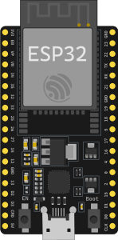<br/><b>ESP32 DevKit C</b></td>
  <td align="center">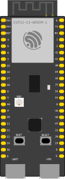<br/><b>ESP32-S3</b></td>
</tr>
<tr>
  <td align="center"><br/><b>ESP32-C3</b></td>
  <td align="center"><br/><b>Seeed XIAO ESP32-C3</b></td>
  <td align="center"><br/><b>ESP32-C3 SuperMini</b></td>
  <td align="center">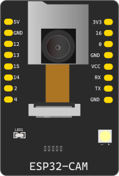<br/><b>ESP32-CAM</b></td>
</tr>
<tr>
  <td align="center">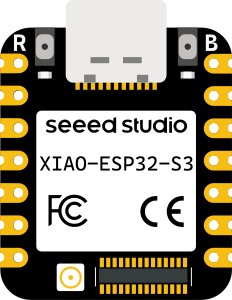<br/><b>Seeed XIAO ESP32-S3</b></td>
  <td align="center">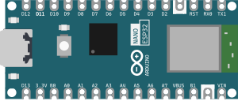<br/><b>Arduino Nano ESP32</b></td>
  <td align="center">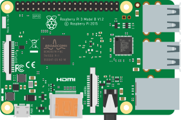<br/><b>Raspberry Pi 3B</b></td>
  <td align="center">Arduino Uno &middot; Nano &middot; Mega 2560<br/>ATtiny85 &middot; Leonardo &middot; Pro Mini<br/>(AVR8 / ATmega)</td>
</tr>
</table>

| Board | CPU | Engine | Language |
| ----- | --- | ------ | -------- |
| **Arduino Uno** | ATmega328p @ 16 MHz | avr8js (browser) | C++ (Arduino) |
| **Arduino Nano** | ATmega328p @ 16 MHz | avr8js (browser) | C++ (Arduino) |
| **Arduino Mega 2560** | ATmega2560 @ 16 MHz | avr8js (browser) | C++ (Arduino) |
| **ATtiny85** | ATtiny85 @ 8 MHz (int) / 16 MHz (ext) | avr8js (browser) | C++ (Arduino) |
| **Arduino Leonardo** | ATmega32u4 @ 16 MHz | avr8js (browser) | C++ (Arduino) |
| **Arduino Pro Mini** | ATmega328p @ 8/16 MHz | avr8js (browser) | C++ (Arduino) |
| **Raspberry Pi Pico** | RP2040 @ 133 MHz | rp2040js (browser) | C++ (Arduino) |
| **Raspberry Pi Pico W** | RP2040 @ 133 MHz | rp2040js (browser) | C++ (Arduino) |
| **ESP32 DevKit V1** | Xtensa LX6 @ 240 MHz | QEMU lcgamboa (backend) | C++ (Arduino) |
| **ESP32 DevKit C V4** | Xtensa LX6 @ 240 MHz | QEMU lcgamboa (backend) | C++ (Arduino) |
| **ESP32-S3** | Xtensa LX7 @ 240 MHz | QEMU lcgamboa (backend) | C++ (Arduino) |
| **ESP32-CAM** | Xtensa LX6 @ 240 MHz | QEMU lcgamboa (backend) | C++ (Arduino) |
| **Seeed XIAO ESP32-S3** | Xtensa LX7 @ 240 MHz | QEMU lcgamboa (backend) | C++ (Arduino) |
| **Arduino Nano ESP32** | Xtensa LX6 @ 240 MHz | QEMU lcgamboa (backend) | C++ (Arduino) |
| **ESP32-C3 DevKit** | RISC-V RV32IMC @ 160 MHz | RiscVCore.ts (browser) | C++ (Arduino) |
| **Seeed XIAO ESP32-C3** | RISC-V RV32IMC @ 160 MHz | RiscVCore.ts (browser) | C++ (Arduino) |
| **ESP32-C3 SuperMini** | RISC-V RV32IMC @ 160 MHz | RiscVCore.ts (browser) | C++ (Arduino) |
| **CH32V003** | RISC-V RV32EC @ 48 MHz | RiscVCore.ts (browser) | C++ (Arduino) |
| **Raspberry Pi 3B** | ARM Cortex-A53 @ 1.2 GHz | QEMU raspi3b (backend) | Python |

---

## Features

### Code Editing

- **Monaco Editor** — Full C++ / Python editor with syntax highlighting, autocomplete, minimap, and dark theme
- **Multi-file workspace** — create, rename, delete, and switch between multiple `.ino` / `.h` / `.cpp` / `.py` files
- **Arduino compilation** via `arduino-cli` backend — compile sketches to `.hex` / `.bin` files
- **Compile / Run / Stop / Reset** toolbar buttons with status messages
- **Compilation console** — resizable output panel showing full compiler output, warnings, and errors

### Multi-Board Simulation

#### AVR8 (Arduino Uno / Nano / Mega / ATtiny85 / Leonardo / Pro Mini)

- **Real ATmega328p / ATmega2560 / ATmega32u4 / ATtiny85 emulation** at native clock speed via avr8js
- **Full GPIO** — PORTB, PORTC, PORTD (Uno/Nano/Mega); all ATtiny85 ports (PB0–PB5)
- **Timer0/Timer1/Timer2** — `millis()`, `delay()`, PWM via `analogWrite()`
- **USART** — full transmit and receive, auto baud-rate detection
- **ADC** — `analogRead()`, voltage injection from potentiometers on canvas
- **SPI** — hardware SPI peripheral (ILI9341, SD card, etc.)
- **I2C (TWI)** — hardware I2C with virtual device bus
- **ATtiny85** — all 6 I/O pins, USI (Wire), Timer0/Timer1, 10-bit ADC; uses `AttinyCore`
- ~60 FPS simulation loop via `requestAnimationFrame`

#### RP2040 (Raspberry Pi Pico / Pico W)

- **Real RP2040 emulation** at 133 MHz via rp2040js — ARM Cortex-M0+
- **All 30 GPIO pins** — input/output, event listeners, pin state injection
- **UART0 + UART1** — serial output in Serial Monitor; Serial input from UI
- **ADC** — 12-bit on GPIO 26–29 (A0–A3) + internal temperature sensor (ch4)
- **I2C0 + I2C1** — master mode with virtual device bus (DS1307, TMP102, EEPROM)
- **SPI0 + SPI1** — loopback default; custom handler supported
- **PWM** — available on any GPIO pin
- **WFI optimization** — `delay()` skips ahead in simulation time instead of busy-waiting
- **Oscilloscope** — GPIO transition timestamps at ~8 ns resolution
- Compiled with the [earlephilhower arduino-pico](https://github.com/earlephilhower/arduino-pico) core

See [docs/RP2040_EMULATION.md](docs/RP2040_EMULATION.md) for full technical details.

#### ESP32 / ESP32-S3 (Xtensa QEMU)

- **Real Xtensa LX6/LX7 dual-core emulation** via [lcgamboa/qemu](https://github.com/lcgamboa/qemu)
- **Full GPIO** — all 40 GPIO pins, direction tracking, state callbacks, GPIO32–39 fix
- **UART0/1/2** — multi-UART serial, baud-rate detection
- **ADC** — 12-bit on all ADC-capable pins (0–3300 mV injection from potentiometers)
- **I2C** — synchronous bus with virtual device response
- **SPI** — full-duplex with configurable MISO byte injection
- **RMT / NeoPixel** — hardware RMT decoder, WS2812 24-bit GRB frame decoding
- **LEDC/PWM** — 16-channel duty cycle readout, LEDC→GPIO mapping, LED brightness
- **WiFi** — SLIRP NAT emulation (`WiFi.begin("PICSimLabWifi", "")`)
- Requires arduino-esp32 **2.0.17** (IDF 4.4.x) — only version compatible with lcgamboa WiFi

See [docs/ESP32_EMULATION.md](docs/ESP32_EMULATION.md) for setup and full technical details.

#### ESP32-C3 / XIAO-C3 / SuperMini / CH32V003 (RISC-V, in-browser)

- **RV32IMC emulation** in TypeScript — no backend, no QEMU, no WebSocket
- **GPIO 0–21** via W1TS/W1TC MMIO registers (ESP32-C3); PB0–PB5 (CH32V003)
- **UART0** serial output in Serial Monitor
- **CH32V003** — RV32EC core at 48 MHz, 16 KB flash, DIP-8 / SOP package — ultra-compact
- **Instant startup** — zero latency, works offline
- **CI-testable** — same TypeScript runs in Vitest

See [docs/RISCV_EMULATION.md](docs/RISCV_EMULATION.md) for full technical details.

#### Raspberry Pi 3B (QEMU raspi3b)

- **Full BCM2837 emulation** via `qemu-system-aarch64 -M raspi3b`
- **Boots real Raspberry Pi OS** (Trixie) — runs Python scripts directly
- **RPi.GPIO shim** — drop-in replacement for the GPIO library; sends pin events to the frontend over a text protocol
- **GPIO 0–27** — output and input, event detection, PWM (binary state)
- **Dual serial** — ttyAMA0 for user Serial Monitor, ttyAMA1 for GPIO protocol
- **Virtual File System** — edit Python scripts in the UI, upload to Pi at boot
- **Multi-board serial bridge** — Pi ↔ Arduino serial communication on the same canvas
- **qcow2 overlay** — base SD image never modified; session changes are isolated

See [docs/RASPBERRYPI3_EMULATION.md](docs/RASPBERRYPI3_EMULATION.md) for full technical details.

### Serial Monitor

- **Live serial output** — characters as the sketch/script sends them
- **Auto baud-rate detection** — reads hardware registers, no manual configuration needed
- **Send data** to the RX pin from the UI
- **Autoscroll** with toggle

### Component System (48+ Components)

- **48 electronic components** from wokwi-elements
- **Component picker** with search, category filters, and live previews
- **Drag-and-drop** repositioning on the simulation canvas
- **Component rotation** in 90° increments
- **Property dialog** — pin roles, Arduino pin assignment, rotate & delete

### Wire System

- **Wire creation** — click a pin to start, click another pin to connect
- **Orthogonal routing** — no diagonal paths
- **8 signal-type wire colors**: Red (VCC), Black (GND), Blue (Analog), Green (Digital), Purple (PWM), Gold (I2C), Orange (SPI), Cyan (USART)
- **Segment-based wire editing** — drag segments perpendicular to their orientation

### Library Manager

- Browse and install the full Arduino library index directly from the UI
- Live search, installed tab, version display

### Auth & Project Persistence

- **Email/password** and **Google OAuth** sign-in
- **Project save** with name, description, and public/private visibility
- **Project URL** — each project gets a permanent URL at `/project/:id`
- **Sketch files stored on disk** per project (accessible from the host via Docker volume)
- **User profile** at `/:username` showing public projects

### Example Projects

- Built-in examples including Blink, Traffic Light, Button Control, Fade LED, Serial Hello World, RGB LED, Simon Says, LCD 20×4, and Pi + Arduino serial control
- One-click loading into the editor

---

## Self-Hosting

### Option A: Docker (single container, recommended)

```bash
# Pull and run
docker run -d \
  --name velxio \
  -p 3080:80 \
  -v $(pwd)/data:/app/data \
  ghcr.io/davidmonterocrespo24/velxio:master
```

Open <http://localhost:3080>.

The `/app/data` volume contains:

- `velxio.db` — SQLite database (users, projects metadata)
- `projects/{id}/` — sketch files per project

### Option B: Docker Compose

```bash
git clone https://github.com/davidmonterocrespo24/velxio.git
cd velxio
cp backend/.env.example backend/.env   # edit as needed
docker compose -f docker-compose.prod.yml up -d
```

#### Environment variables (`backend/.env`)

| Variable | Default | Description |
| --- | --- | --- |
| `SECRET_KEY` | *(required)* | JWT signing secret |
| `DATABASE_URL` | `sqlite+aiosqlite:////app/data/velxio.db` | SQLite path |
| `DATA_DIR` | `/app/data` | Directory for project files |
| `FRONTEND_URL` | `http://localhost:5173` | Used for OAuth redirect |
| `GOOGLE_CLIENT_ID` | — | Google OAuth client ID |
| `GOOGLE_CLIENT_SECRET` | — | Google OAuth client secret |
| `GOOGLE_REDIRECT_URI` | `http://localhost:8001/api/auth/google/callback` | Must match Google Console |
| `COOKIE_SECURE` | `false` | Set `true` when serving over HTTPS |

### Option C: Manual Setup

**Prerequisites:** Node.js 18+, Python 3.12+, arduino-cli

```bash
git clone --recurse-submodules https://github.com/davidmonterocrespo24/velxio.git
cd velxio
```

> **Already cloned without `--recurse-submodules`?** The `wokwi-libs/` directories will be empty. Run:
> ```bash
> git submodule update --init --recursive
> ```
> If that fails because the submodule pointers are stale, clone the libs fresh:
> ```bash
> cd wokwi-libs
> git clone --depth=1 https://github.com/wokwi/avr8js.git avr8js
> git clone --depth=1 https://github.com/wokwi/wokwi-elements.git wokwi-elements
> git clone --depth=1 https://github.com/wokwi/rp2040js.git rp2040js
> cd ..
> ```

**Build the Wokwi libraries** (required before running the frontend):

```bash
cd wokwi-libs/avr8js && npm install && npm run build && cd ../..
cd wokwi-libs/wokwi-elements && npm install && npm run build && cd ../..
cd wokwi-libs/rp2040js && npm install && npm run build && cd ../..
```

```bash
# Backend
cd backend
python -m venv venv && source venv/bin/activate  # Windows: venv\Scripts\activate
pip install -r requirements.txt
uvicorn app.main:app --reload --port 8001

# Frontend (new terminal)
cd frontend
npm install
npm run dev
```

Open <http://localhost:5173>.

**arduino-cli setup (first time):**

```bash
arduino-cli core update-index
arduino-cli core install arduino:avr

# For Raspberry Pi Pico / Pico W:
arduino-cli config add board_manager.additional_urls \
  https://github.com/earlephilhower/arduino-pico/releases/download/global/package_rp2040_index.json
arduino-cli core install rp2040:rp2040

# For ESP32 / ESP32-S3 / ESP32-C3:
arduino-cli config add board_manager.additional_urls \
  https://raw.githubusercontent.com/espressif/arduino-esp32/gh-pages/package_esp32_index.json
arduino-cli core install esp32:esp32@2.0.17
```

---

## Project Structure

```text
velxio/
├── frontend/                    # React + Vite + TypeScript
│   └── src/
│       ├── pages/               # LandingPage, EditorPage, UserProfilePage, ...
│       ├── components/          # Editor, simulator canvas, modals, layout
│       ├── simulation/          # AVRSimulator, RP2040Simulator, RiscVCore,
│       │                        # RaspberryPi3Bridge, Esp32Bridge, PinManager
│       ├── store/               # Zustand stores (auth, editor, simulator, project, vfs)
│       └── services/            # API clients
├── backend/                     # FastAPI + Python
│   └── app/
│       ├── api/routes/          # compile, auth, projects, libraries, simulation (ws)
│       ├── models/              # User, Project (SQLAlchemy)
│       ├── services/            # arduino_cli, esp32_worker, qemu_manager, gpio_shim
│       └── core/                # config, security, dependencies
├── wokwi-libs/                  # Local clones of Wokwi repos
│   ├── wokwi-elements/          # Web Components for electronic parts
│   ├── avr8js/                  # AVR8 CPU emulator
│   ├── rp2040js/                # RP2040 emulator
│   └── qemu-lcgamboa/           # QEMU fork for ESP32 Xtensa emulation
├── img/                         # Raspberry Pi 3 boot images (kernel8.img, dtb, OS image)
├── deploy/                      # nginx.conf, entrypoint.sh
├── docs/                        # Technical documentation
├── Dockerfile.standalone        # Single-container production image
├── docker-compose.yml           # Development compose
└── docker-compose.prod.yml      # Production compose
```

---

## Technologies

| Layer | Stack |
| --- | --- |
| Frontend | React 19, Vite 7, TypeScript 5.9, Monaco Editor, Zustand, React Router 7 |
| Backend | FastAPI, SQLAlchemy 2.0 async, aiosqlite, uvicorn |
| AVR Simulation | avr8js (ATmega328p / ATmega2560) |
| RP2040 Simulation | rp2040js (ARM Cortex-M0+) |
| RISC-V Simulation | RiscVCore.ts (RV32IMC, custom TypeScript) |
| ESP32 Simulation | QEMU 8.1.3 lcgamboa fork (Xtensa LX6/LX7) |
| Raspberry Pi 3 Simulation | QEMU 8.1.3 (`qemu-system-aarch64 -M raspi3b`) + Raspberry Pi OS Trixie |
| UI Components | wokwi-elements (Web Components) |
| Compiler | arduino-cli (subprocess) |
| Auth | JWT (httpOnly cookie), Google OAuth 2.0 |
| Persistence | SQLite + disk volume (`/app/data/projects/{id}/`) |
| Deploy | Docker, nginx, GitHub Actions → GHCR + Docker Hub |

---

## Documentation

| Topic | Document |
| --- | --- |
| Getting Started | [docs/getting-started.md](docs/getting-started.md) |
| Architecture Overview | [docs/ARCHITECTURE.md](docs/ARCHITECTURE.md) |
| Emulator Architecture | [docs/emulator.md](docs/emulator.md) |
| Wokwi Libraries Integration | [docs/WOKWI_LIBS.md](docs/WOKWI_LIBS.md) |
| RP2040 Emulation (Pico) | [docs/RP2040_EMULATION.md](docs/RP2040_EMULATION.md) |
| Raspberry Pi 3 Emulation | [docs/RASPBERRYPI3_EMULATION.md](docs/RASPBERRYPI3_EMULATION.md) |
| ESP32 Emulation (Xtensa) | [docs/ESP32_EMULATION.md](docs/ESP32_EMULATION.md) |
| RISC-V Emulation (ESP32-C3) | [docs/RISCV_EMULATION.md](docs/RISCV_EMULATION.md) |
| Components Reference | [docs/components.md](docs/components.md) |
| MCP Server | [docs/MCP.md](docs/MCP.md) |
| Roadmap | [docs/roadmap.md](docs/roadmap.md) |

---

## Troubleshooting

**`arduino-cli: command not found`** — install arduino-cli and add to PATH.

**LED doesn't blink** — check port listeners in browser console; verify pin mapping in the component property dialog.

**Serial Monitor shows nothing** — ensure `Serial.begin()` is called before `Serial.print()`.

**ESP32 not starting** — verify `libqemu-xtensa.dll` (Windows) or `libqemu-xtensa.so` (Linux) is present in `backend/app/services/`.

**Pi 3 takes too long to boot** — QEMU needs 2–5 seconds to initialize; the "booting" status in the UI is expected.

**Compilation errors** — check the compilation console; verify the correct core is installed for the selected board.

---

## Community

Join the Discord server to ask questions, share projects, and follow updates:

**[discord.gg/3mARjJrh4E](https://discord.gg/3mARjJrh4E)**

## Contributing

Suggestions, bug reports, and pull requests are welcome at [github.com/davidmonterocrespo24/velxio](https://github.com/davidmonterocrespo24/velxio).

If you'd like to support the project financially, see the [Support the Project](#support-the-project) section above or sponsor directly at [github.com/sponsors/davidmonterocrespo24](https://github.com/sponsors/davidmonterocrespo24).

> **Note:** All contributors must sign a Contributor License Agreement (CLA) so that the dual-licensing model remains valid. A CLA check runs automatically on pull requests.

## License

Velxio uses a **dual-licensing** model:

| Use case | License | Cost |
| --- | --- | --- |
| Personal, educational, open-source (AGPLv3 compliant) | [AGPLv3](LICENSE) | Free |
| Proprietary / closed-source product or SaaS | [Commercial License](COMMERCIAL_LICENSE.md) | Paid |

The AGPLv3 is a certified Open Source license. It is free for all uses — including commercial — as long as any modifications or network-accessible deployments make their source code available under the same license. Companies that cannot comply with that requirement can purchase a Commercial License.

For commercial licensing inquiries: [davidmonterocrespo24@gmail.com](mailto:davidmonterocrespo24@gmail.com)

See [LICENSE](LICENSE) and [COMMERCIAL_LICENSE.md](COMMERCIAL_LICENSE.md) for full terms.

## Star History

[](https://star-history.com/#davidmonterocrespo24/velxio&Date)

---

## References

- [Wokwi](https://wokwi.com) — Inspiration
- [avr8js](https://github.com/wokwi/avr8js) — AVR8 emulator
- [wokwi-elements](https://github.com/wokwi/wokwi-elements) — Electronic web components
- [rp2040js](https://github.com/wokwi/rp2040js) — RP2040 emulator
- [lcgamboa/qemu](https://github.com/lcgamboa/qemu) — QEMU fork for ESP32 Xtensa emulation
- [arduino-cli](https://github.com/arduino/arduino-cli) — Arduino compiler
- [Monaco Editor](https://microsoft.github.io/monaco-editor/) — Code editor
- [QEMU](https://www.qemu.org) — Machine emulator (Raspberry Pi 3)
