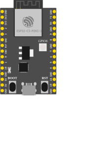
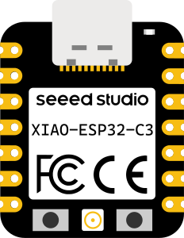
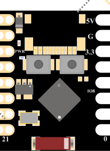

# RISC-V Emulation (ESP32-C3 / XIAO-C3 / C3 SuperMini)

> Status: **Functional** · Backend QEMU (`libqemu-riscv32`) — same pattern as ESP32/ESP32-S3
> Engine: **QEMU lcgamboa — riscv32-softmmu** compiled with `esp32c3-picsimlab` machine
> Platform: **ESP32-C3 @ 160 MHz** — 32-bit RISC-V RV32IMC architecture

> **Unit-test / ISA layer:** `RiscVCore.ts` and `Esp32C3Simulator.ts` are TypeScript implementations
> used exclusively for Vitest unit tests; they are **not** the production emulation path.

---

## Table of Contents

1. [Overview](#1-overview)
2. [Supported Boards](#2-supported-boards)
3. [Architecture — QEMU Backend Path](#3-architecture--qemu-backend-path)
4. [Setup on Windows — Building `libqemu-riscv32.dll`](#4-setup-on-windows--building-libqemu-riscv32dll)
5. [Setup on Linux / Docker](#5-setup-on-linux--docker)
6. [GPIO Pinmap — 22 GPIOs](#6-gpio-pinmap--22-gpios)
7. [Full Flow: Compile and Run](#7-full-flow-compile-and-run)
8. [ESP32 Image Format](#8-esp32-image-format)
9. [Supported ISA — RV32IMC](#9-supported-isa--rv32imc)
10. [GPIO — MMIO Registers](#10-gpio--mmio-registers)
11. [UART0 — Serial Monitor](#11-uart0--serial-monitor)
12. [Limitations of the riscv32 QEMU machine](#12-limitations-of-the-riscv32-qemu-machine)
13. [Tests](#13-tests)
14. [Differences vs Xtensa Emulation (ESP32 / ESP32-S3)](#14-differences-vs-xtensa-emulation-esp32--esp32-s3)
15. [Key Files](#15-key-files)

---

## 1. Overview

Boards based on **ESP32-C3** use Espressif's **ESP32-C3** processor, implementing the **RISC-V RV32IMC** architecture. In production the system uses the same QEMU backend pattern as ESP32/ESP32-S3, but with a different library (`libqemu-riscv32`) and a different machine target (`esp32c3-picsimlab`).

> The browser-side TypeScript emulator (`RiscVCore.ts` + `Esp32C3Simulator.ts`) cannot handle the 150+ ROM functions that ESP-IDF needs during initialization. All production runs go through the QEMU backend. The TypeScript layer is kept as unit-test infrastructure for the RV32IMC ISA.

### Emulation Engine Comparison

| Board | CPU | Production Engine | Unit-Test Engine |
| ----- | --- | ----------------- | ---------------- |
| ESP32, ESP32-S3 | Xtensa LX6/LX7 | QEMU lcgamboa `libqemu-xtensa` | — |
| **ESP32-C3, XIAO-C3, C3 SuperMini** | **RV32IMC @ 160 MHz** | **QEMU lcgamboa `libqemu-riscv32`** | RiscVCore.ts (Vitest) |
| Arduino Uno/Nano/Mega | AVR ATmega | avr8js (browser) | — |
| Raspberry Pi Pico | RP2040 | rp2040js (browser) | — |

### Key differences vs Xtensa (ESP32)

- Different library: `libqemu-riscv32.dll/.so` instead of `libqemu-xtensa`
- Different machine: `esp32c3-picsimlab` instead of `esp32-picsimlab`
- 22 GPIOs (GPIO 0–21) instead of 40; worker auto-adjusts pinmap
- ROM file: `esp32c3-rom.bin` (384 KB) instead of `esp32-v3-rom.bin`
- WiFi, LEDC/PWM, RMT/NeoPixel: **not yet emulated** in the riscv32 machine
- Build flag: `--disable-slirp` required (riscv32 target has incompatible pointer types in `net/slirp.c`)

---

## 2. Supported Boards

<table>
<tr>
  <td align="center"><br/><b>ESP32-C3 DevKit</b></td>
  <td align="center"><br/><b>Seeed XIAO ESP32-C3</b></td>
  <td align="center"><br/><b>ESP32-C3 SuperMini</b></td>
</tr>
</table>

| Board | arduino-cli FQBN | Built-in LED |
| ----- | ---------------- | ------------ |
| ESP32-C3 DevKit | `esp32:esp32:esp32c3` | GPIO 8 |
| Seeed XIAO ESP32-C3 | `esp32:esp32:XIAO_ESP32C3` | GPIO 10 (active-low) |
| ESP32-C3 SuperMini | `esp32:esp32:esp32c3` | GPIO 8 |

---

## 3. Architecture — QEMU Backend Path

```text
User (browser)
  └── WebSocket (/ws/{client_id})
        └── simulation.py  (FastAPI router)
              └── EspLibManager
                    │
              board_type in _RISCV_BOARDS?
              ├── YES → lib_path = LIB_RISCV_PATH  (libqemu-riscv32.dll/.so)
              │           machine  = 'esp32c3-picsimlab'
              │           _build_pinmap(22)          ← 22 GPIOs, not 40
              └── NO  → lib_path = LIB_PATH          (libqemu-xtensa.dll/.so)
                          machine  = 'esp32-picsimlab' or 'esp32s3-picsimlab'
                          pinmap = 40 GPIOs
                    │
              esp32_worker.py (subprocess)
                    │
              ctypes.CDLL(libqemu-riscv32.dll)
                    │
              Machine: esp32c3-picsimlab
              CPU:     RISC-V RV32IMC @ 160 MHz
                    │
         ┌──────────┴──────────┐
     ESP32-C3 core         emulated peripherals
     (single core)    GPIO (22 pins) · UART0 · SPI Flash
```

**Required files (same directory as the lib):**

| File | Size | Source |
|------|------|--------|
| `libqemu-riscv32.dll` | ~58 MB | Compiled from `wokwi-libs/qemu-lcgamboa` (see §4) |
| `esp32c3-rom.bin` | 384 KB | `wokwi-libs/qemu-lcgamboa/pc-bios/esp32c3-rom.bin` |

### TypeScript / Browser layer (unit tests only)

The `RiscVCore.ts` + `Esp32C3Simulator.ts` classes exist for **Vitest unit tests only**. They provide a fast, offline RV32IMC interpreter that can run bare-metal binaries. They cannot handle the full ESP-IDF initialization sequence needed by real Arduino sketches.

| Class | File | Used in |
| ----- | ---- | ------- |
| `RiscVCore` | `simulation/RiscVCore.ts` | Vitest ISA unit tests |
| `Esp32C3Simulator` | `simulation/Esp32C3Simulator.ts` | Vitest end-to-end tests |
| `parseMergedFlashImage` | `utils/esp32ImageParser.ts` | Vitest + compile flow |

---

## 4. Setup on Windows — Building `libqemu-riscv32.dll`

This section covers building the RISC-V QEMU library from source on Windows with MSYS2.

### 4.1 Prerequisites

Same as the Xtensa build (see [ESP32_EMULATION.md §1.1–1.4](./ESP32_EMULATION.md)), except:
- `--disable-slirp` is **required** — `net/slirp.c` has incompatible pointer types in the riscv32-softmmu target that cause a compile error with GCC 15.x.
- `--enable-gcrypt` is **required** — matches the working Xtensa DLL linking pattern and avoids GCC emutls/pthread crash on Windows.

Install MSYS2 dependencies (same as Xtensa, **without** `libslirp`):

```bash
pacman -S \
  mingw-w64-x86_64-gcc \
  mingw-w64-x86_64-glib2 \
  mingw-w64-x86_64-libgcrypt \
  mingw-w64-x86_64-pixman \
  mingw-w64-x86_64-ninja \
  mingw-w64-x86_64-meson \
  mingw-w64-x86_64-python \
  mingw-w64-x86_64-pkg-config \
  git diffutils
```

### 4.2 Configure and Build

```bash
# In MSYS2 MINGW64:
cd /e/Hardware/wokwi_clon/wokwi-libs/qemu-lcgamboa

mkdir build-riscv && cd build-riscv

../configure \
  --target-list=riscv32-softmmu \
  --disable-werror \
  --disable-alsa \
  --enable-tcg \
  --enable-system \
  --enable-gcrypt \
  --disable-slirp \
  --enable-iconv \
  --without-default-features \
  --disable-docs

ninja          # compiles ~1430 objects, takes 15-30 min first time
```

> **Why `--disable-slirp`?** GCC 15.x rejects the `net/slirp.c` code in the riscv32 machine due to incompatible pointer types in `slirp_smb_init`. Adding `-fpermissive` or `-Wno-incompatible-pointer-types` is also an option, but `--disable-slirp` is cleaner since this machine does not need network emulation.

### 4.3 Create the DLL (keeprsp trick)

QEMU's build system produces an executable (`qemu-system-riscv32.exe`) rather than a shared library. To get a DLL, relink all objects and exclude `softmmu_main.c.obj` (which contains `main()`):

```bash
# From build-riscv/:

# 1. Build the full exe first to generate the link response file:
ninja qemu-system-riscv32.exe

# 2. Capture the link command from ninja's database:
ninja -t commands qemu-system-riscv32.exe | tail -1 > dll_link.rsp

# 3. Edit dll_link.rsp:
#    - Replace -o qemu-system-riscv32.exe with: -shared -o libqemu-riscv32.dll
#    - Remove the softmmu_main.c.obj entry
#    - Add: -Wl,--export-all-symbols -Wl,--allow-multiple-definition

# 4. Relink:
gcc @dll_link.rsp

# 5. Verify:
ls -lh libqemu-riscv32.dll      # should be ~58 MB
objdump -p libqemu-riscv32.dll | grep qemu_picsimlab
```

### 4.4 Copy to Backend

```bash
cp libqemu-riscv32.dll /e/Hardware/wokwi_clon/backend/app/services/
cp ../pc-bios/esp32c3-rom.bin /e/Hardware/wokwi_clon/backend/app/services/
```

**Verify:**
```bash
ls -lh /e/Hardware/wokwi_clon/backend/app/services/libqemu-riscv32.dll
ls -lh /e/Hardware/wokwi_clon/backend/app/services/esp32c3-rom.bin
# libqemu-riscv32.dll  ~58 MB
# esp32c3-rom.bin      384 KB
```

### 4.5 Verify DLL Loads

```python
# Run from backend/ with venv active:
python -c "
import ctypes, os
os.add_dll_directory(r'C:\msys64\mingw64\bin')
lib = ctypes.CDLL(r'app/services/libqemu-riscv32.dll')
print('qemu_init:', lib.qemu_init)
print('qemu_picsimlab_register_callbacks:', lib.qemu_picsimlab_register_callbacks)
print('OK — DLL loaded successfully')
"
```

### 4.6 Verify Emulation End-to-End

```bash
cd backend
python test_esp32c3_emulation.py
# Expected: PASS — GPIO8 toggled 2 times — ESP32-C3 emulation is working!
```

---

## 5. Setup on Linux / Docker

### 5.1 Docker (automatic)

The Dockerfile should compile `libqemu-riscv32.so` alongside `libqemu-xtensa.so`. Add the riscv32 target to the configure step:

```dockerfile
RUN cd /tmp/qemu-lcgamboa && ../configure \
      --target-list=xtensa-softmmu,riscv32-softmmu \
      --enable-gcrypt \
      --disable-slirp \
      ... \
  && ninja \
  && cp build/libqemu-xtensa.so /app/lib/ \
  && cp build/libqemu-riscv32.so /app/lib/ \
  && cp pc-bios/esp32c3-rom.bin /app/lib/
```

### 5.2 Linux (manual)

```bash
sudo apt-get install -y libglib2.0-dev libgcrypt20-dev libpixman-1-dev libfdt-dev

cd wokwi-libs/qemu-lcgamboa
mkdir build-riscv && cd build-riscv

../configure \
  --target-list=riscv32-softmmu \
  --enable-gcrypt \
  --disable-slirp \
  --without-default-features \
  --disable-docs

ninja
cp libqemu-riscv32.so ../../backend/app/services/
cp ../pc-bios/esp32c3-rom.bin ../../backend/app/services/
```

---

## 6. GPIO Pinmap — 22 GPIOs

The ESP32-C3 has **22 GPIOs (GPIO 0–21)**, fewer than the 40 on the ESP32. The QEMU machine (`esp32c3-picsimlab`) registers only 22 GPIO output lines in the QOM model. Sending a pinmap with more entries causes a QEMU property lookup error:

```
qemu: Property 'esp32c3.gpio.esp32_gpios[22]' not found
```

The worker (`esp32_worker.py`) detects the machine and rebuilds the pinmap before registering callbacks:

```python
# In main(), right after reading config:
if 'c3' in machine:          # 'esp32c3-picsimlab'
    _build_pinmap(22)        # GPIO 0..21 only
# else: default pinmap (40 GPIOs for ESP32/ESP32-S3)
```

`_build_pinmap(n)` creates a `ctypes.c_int16` array of `n+1` elements:
```python
def _build_pinmap(gpio_count: int):
    global _GPIO_COUNT, _PINMAP
    _GPIO_COUNT = gpio_count
    _PINMAP = (ctypes.c_int16 * (gpio_count + 1))(
        gpio_count,        # [0] = count
        *range(gpio_count) # [1..n] = GPIO numbers 0..n-1
    )
```

This is passed to QEMU via `_cbs_ref.pinmap`. When GPIO N changes, QEMU calls `picsimlab_write_pin(slot=N+1, value)` and the worker translates `slot → N` before emitting `{type: gpio_change, pin: N, state: value}`.

---

## 7. Full Flow: Compile and Run

### 7.1 Compile the Sketch

```bash
# arduino-cli compiles for ESP32-C3:
arduino-cli compile \
  --fqbn esp32:esp32:esp32c3 \
  --output-dir build/ \
  mi_sketch/

# The backend automatically creates the merged image:
#   build/mi_sketch.ino.bootloader.bin  → 0x01000
#   build/mi_sketch.ino.partitions.bin  → 0x08000
#   build/mi_sketch.ino.bin             → 0x10000 (app)
#   → merged: sketch.ino.merged.bin (4 MB)
```

The Velxio backend produces this image automatically and sends it to the frontend as base64.

### 7.2 Minimal Sketch for ESP32-C3

```cpp
// LED on GPIO 8 (ESP32-C3 DevKit)
#define LED_PIN 8

void setup() {
  pinMode(LED_PIN, OUTPUT);
  Serial.begin(115200);
  Serial.println("ESP32-C3 started");
}

void loop() {
  digitalWrite(LED_PIN, HIGH);
  Serial.println("LED ON");
  delay(500);
  digitalWrite(LED_PIN, LOW);
  Serial.println("LED OFF");
  delay(500);
}
```

### 7.3 Bare-Metal Sketch (for unit-test runner only)

To verify the emulation without the Arduino framework, you can compile directly with the RISC-V toolchain:

```c
/* blink.c — bare-metal, no ESP-IDF */
#define GPIO_W1TS  (*(volatile unsigned int *)0x60004008u)
#define GPIO_W1TC  (*(volatile unsigned int *)0x6000400Cu)
#define LED_BIT    (1u << 8)

static void delay(int n) { for (volatile int i = 0; i < n; i++); }

void _start(void) {
  while (1) {
    GPIO_W1TS = LED_BIT;   /* LED ON  */
    delay(500);
    GPIO_W1TC = LED_BIT;   /* LED OFF */
    delay(500);
  }
}
```

Compile with the toolchain bundled in arduino-cli:

```bash
# Toolchain installed with: arduino-cli core install esp32:esp32
TOOLCHAIN="$LOCALAPPDATA/Arduino15/packages/esp32/tools/riscv32-esp-elf-gcc/esp-2021r2-patch5-8.4.0/bin"

"$TOOLCHAIN/riscv32-esp-elf-gcc" \
  -march=rv32imc -mabi=ilp32 -Os -nostdlib -nostartfiles \
  -T link.ld -o blink.elf blink.c

"$TOOLCHAIN/riscv32-esp-elf-objcopy" -O binary blink.elf blink.bin
```

See full script: `frontend/src/__tests__/fixtures/esp32c3-blink/build.sh`

---

## 8. ESP32 Image Format

The backend produces a merged **4 MB** image:

```text
Offset 0x00000: 0xFF (empty)
Offset 0x01000: bootloader   (ESP32 format image, magic 0xE9)
Offset 0x08000: partition table
Offset 0x10000: app binary   (ESP32 format image, magic 0xE9) ← parsed here
```

### ESP32 Image Header (24 bytes)

```text
+0x00  magic (0xE9)
+0x01  segment_count
+0x02  spi_mode
+0x03  spi_speed_size
+0x04  entry_addr       ← uint32 LE — firmware entry point PC
+0x08  extended fields (16 bytes)
```

### Segment Header (8 bytes)

```text
+0x00  load_addr   ← destination virtual address (e.g. 0x42000000)
+0x04  data_len
+0x08  data[data_len]
```

The `parseMergedFlashImage()` parser in `utils/esp32ImageParser.ts` extracts all segments and the entry point, which is used for the core reset (`core.reset(entryPoint)`).

---

## 9. Supported ISA — RV32IMC

`RiscVCore.ts` implements the three extensions required to run code compiled for ESP32-C3:

### RV32I — Base Integer (40 instructions)

Includes: LUI, AUIPC, JAL, JALR, BEQ/BNE/BLT/BGE/BLTU/BGEU, LB/LH/LW/LBU/LHU, SB/SH/SW, ADDI/SLTI/SLTIU/XORI/ORI/ANDI/SLLI/SRLI/SRAI, ADD/SUB/SLL/SLT/SLTU/XOR/SRL/SRA/OR/AND, FENCE, ECALL/EBREAK, CSR (reads return 0)

### RV32M — Multiply and Divide (8 instructions)

| Instruction | Operation |
| ----------- | --------- |
| `MUL` | Integer product (low 32 bits) |
| `MULH` | Signed product (high 32 bits) |
| `MULHSU` | Mixed signed×unsigned product (high bits) |
| `MULHU` | Unsigned product (high 32 bits) |
| `DIV` | Signed integer division |
| `DIVU` | Unsigned integer division |
| `REM` | Signed remainder |
| `REMU` | Unsigned remainder |

### RV32C — Compressed Instructions (16-bit)

All 16-bit instructions from the standard C extension are supported. They are detected by `(halfword & 3) !== 3` and decompressed to their RV32I equivalent before execution. This is critical: the GCC compiler for ESP32-C3 heavily generates C instructions (`c.addi`, `c.sw`, `c.lw`, `c.j`, `c.beqz`, `c.bnez`, etc.) which represent ~30-40% of all instructions in the final binary.

---

## 10. GPIO — MMIO Registers

> Note: these registers are used by the TypeScript unit-test layer (`RiscVCore.ts`). The QEMU backend handles GPIO via the `picsimlab_write_pin` callback, not MMIO polling.

GPIO MMIO layout on the ESP32-C3:

```typescript
// Arduino sketch:
digitalWrite(8, HIGH);  // → internally writes 1<<8 to GPIO_OUT_W1TS_REG

// In the simulator:
// SW x10, 0(x12)  where x10=256 (1<<8), x12=0x60004008 (W1TS)
// → writes 4 bytes to 0x60004008..0x6000400B
// → byteIdx=1 (offset 0x09): val=0x01, shift=8 → gpioOut |= 0x100
// → changed = prev ^ gpioOut ≠ 0 → fires onPinChangeWithTime(8, true, timeMs)
```

The callback `onPinChangeWithTime(pin, state, timeMs)` is the integration point with the visual components. `timeMs` is the simulated time in milliseconds (calculated as `core.cycles / CPU_HZ * 1000`).

---

## 11. UART0 — Serial Monitor

Any byte written to `UART0_FIFO_REG` (0x60000000) calls the `onSerialData(char)` callback:

```cpp
// Arduino sketch:
Serial.println("Hello!");
// → Arduino framework writes the bytes of "Hello!\r\n" to UART0_FIFO_REG
// → simulator calls onSerialData("H"), onSerialData("e"), ...
// → Serial Monitor displays "Hello!"
```

To send data to the sketch from the Serial Monitor:

```typescript
sim.serialWrite("COMMAND\n");
// → bytes are added to rxFifo
// → reading UART0_FIFO_REG dequeues one byte from rxFifo
```

---

## 12. Limitations of the riscv32 QEMU machine

The `esp32c3-picsimlab` QEMU machine in the lcgamboa fork emulates the core CPU and GPIO. The following are **not yet implemented** in the QEMU machine (as of 2026-03):

| Feature | Status | Notes |
| ------- | ------ | ----- |
| WiFi / BLE | Not emulated | No slirp networking in riscv32 machine |
| LEDC / PWM | Not emulated | No rmt/ledc callbacks yet |
| RMT / NeoPixel | Not emulated | No RMT peripheral in esp32c3-picsimlab |
| ADC | Not emulated | GPIO 0-5 ADC channels not wired |
| Hardware I2C / SPI | Not emulated | Callbacks not registered |
| Interrupts (`attachInterrupt`) | Not emulated | GPIO interrupt lines not connected |
| NVS / SPIFFS | Not emulated | Flash writes not persisted |
| arduino-esp32 3.x (IDF 5.x) | **Unsupported** | Use 2.0.17 (IDF 4.4.x) — same as Xtensa |

> The QEMU machine boots the ESP-IDF bootloader and transitions to the Arduino `setup()`/`loop()` correctly for GPIO and UART sketches. Sketches using WiFi, LEDC, or RMT will boot but those peripherals will silently do nothing.

---

## 13. Tests

### 13.1 End-to-End Test (Backend QEMU)

File: `backend/test_esp32c3_emulation.py`

```bash
cd backend
python test_esp32c3_emulation.py
# Expected: PASS — GPIO8 toggled 2 times — ESP32-C3 emulation is working!
```

Compiles a blink sketch via arduino-cli, merges a 4 MB flash image, launches the worker, and checks that GPIO8 toggles at least twice within 45 s.

### 13.2 RiscVCore ISA Unit Tests (TypeScript)

RISC-V emulation tests are in `frontend/src/__tests__/`:

```bash
cd frontend
npm test -- esp32c3
```

### `esp32c3-simulation.test.ts` — 30 tests (ISA unit tests)

Directly verifies the instruction decoder in `RiscVCore`:

| Group | Tests | What it verifies |
| ----- | ----- | ---------------- |
| RV32M | 8 | MUL, MULH, MULHSU, MULHU, DIV, DIVU, REM, REMU |
| RV32C | 7 | C.ADDI, C.LI, C.LWSP, C.SWSP, C.MV, C.ADD, C.J, C.BEQZ |
| UART | 3 | Write to FIFO → onSerialData, RX read, multiple bytes |
| GPIO | 8 | W1TS set bit, W1TC clear bit, toggle, timestamp, multiple pins |
| Lifecycle | 4 | reset(), start/stop, basic loadHex |

### `esp32c3-blink.test.ts` — 8 tests (end-to-end integration)

Compiles `blink.c` with `riscv32-esp-elf-gcc` (the arduino-cli toolchain) and verifies execution in the simulator:

| Test | What it verifies |
| ---- | ---------------- |
| `build.sh produces blink.bin` | Toolchain compiles correctly |
| `binary starts with valid RV32 instruction` | Entry point is valid RISC-V code |
| `loadBin() resets PC to 0x42000000` | Correct loading into flash |
| `GPIO 8 goes HIGH after first SW` | First toggle correct |
| `GPIO 8 toggles ON and OFF` | 7 toggles in 2000 steps (4 ON, 3 OFF) |
| `PinManager.setPinState called` | Integration with the component system |
| `timestamps increase monotonically` | Simulated time is consistent |
| `reset() clears GPIO state` | Functional reset |

**Expected result:**

> Note: these TypeScript tests run against `RiscVCore.ts` (the in-browser interpreter), not against the QEMU backend.

```text
✓ esp32c3-simulation.test.ts  (30 tests)  ~500ms
✓ esp32c3-blink.test.ts        (8 tests)  ~300ms
```

### Bare-Metal Test Binary

```text
frontend/src/__tests__/fixtures/esp32c3-blink/
├── blink.c       ← bare-metal source code
├── link.ld       ← linker script (IROM @ 0x42000000, DRAM @ 0x3FC80000)
├── build.sh      ← build script (uses arduino-cli toolchain)
├── blink.elf     ← (generated) ELF with debug info
├── blink.bin     ← (generated) raw 58-byte binary
└── blink.dis     ← (generated) disassembly for inspection
```

---

## 14. Differences vs Xtensa Emulation (ESP32 / ESP32-S3)

| Aspect | ESP32-C3 (RISC-V) | ESP32 / ESP32-S3 (Xtensa) |
| ------ | ----------------- | ------------------------- |
| QEMU library | `libqemu-riscv32.dll/.so` | `libqemu-xtensa.dll/.so` |
| QEMU machine | `esp32c3-picsimlab` | `esp32-picsimlab` / `esp32s3-picsimlab` |
| ROM file | `esp32c3-rom.bin` (384 KB) | `esp32-v3-rom.bin` + `esp32-v3-rom-app.bin` |
| GPIO count | **22** (GPIO 0–21) | **40** (GPIO 0–39) |
| Build target | `--target-list=riscv32-softmmu` | `--target-list=xtensa-softmmu` |
| `--disable-slirp` required | **Yes** (slirp.c incompatible pointer types with riscv32) | No (slirp works with xtensa) |
| WiFi | Not emulated | Emulated (hardcoded SSIDs via SLIRP) |
| LEDC/PWM | Not emulated | Emulated (periodic polling via internals) |
| NeoPixel/RMT | Not emulated | Emulated (RMT decoder in worker) |
| I2C / SPI | Not emulated | Emulated (synchronous QEMU callbacks) |
| GPIO32–39 fix | N/A (only 22 GPIOs) | Required (bank 1 register) |
| Arduino framework | Full (IDF 4.4.x) | Full (IDF 4.4.x) |
| ISA unit tests | Yes (Vitest — RiscVCore.ts) | No (requires native lib) |

---

## 15. Key Files

### Backend

| File | Description |
| ---- | ----------- |
| `backend/app/services/libqemu-riscv32.dll` | QEMU riscv32 shared library (**not in git** — build locally) |
| `backend/app/services/esp32c3-rom.bin` | ESP32-C3 boot ROM (**not in git** — copy from pc-bios/) |
| `backend/app/services/esp32_worker.py` | QEMU subprocess worker; calls `_build_pinmap(22)` for C3 |
| `backend/app/services/esp32_lib_manager.py` | `_RISCV_BOARDS`, `_MACHINE`, `LIB_RISCV_PATH`; selects right DLL |
| `backend/test_esp32c3_emulation.py` | End-to-end test: compile → flash → QEMU worker → GPIO toggle |

### Frontend

| File | Description |
| ---- | ----------- |
| `frontend/src/store/useSimulatorStore.ts` | `ESP32_RISCV_KINDS` set; `isRiscVEsp32Kind()` routes to QEMU bridge |
| `frontend/src/simulation/RiscVCore.ts` | RV32IMC interpreter (unit-test layer only) |
| `frontend/src/simulation/Esp32C3Simulator.ts` | ESP32-C3 SoC wrapper (unit-test layer only) |
| `frontend/src/utils/esp32ImageParser.ts` | ESP32 image format parser (merged flash → segments) |
| `frontend/src/__tests__/esp32c3-simulation.test.ts` | RV32IMC ISA unit tests (30 tests — TypeScript only) |
| `frontend/src/__tests__/esp32c3-blink.test.ts` | End-to-end bare-metal test (8 tests — TypeScript only) |
| `frontend/src/__tests__/fixtures/esp32c3-blink/` | Bare-metal test firmware + toolchain script |

### QEMU Source

| File | Description |
| ---- | ----------- |
| `wokwi-libs/qemu-lcgamboa/hw/riscv/esp32c3_picsimlab.c` | ESP32-C3 PICSimLab machine definition |
| `wokwi-libs/qemu-lcgamboa/hw/gpio/esp32c3_gpio.c` | ESP32-C3 GPIO model (inherits esp32_gpio, 22 outputs) |
| `wokwi-libs/qemu-lcgamboa/pc-bios/esp32c3-rom.bin` | ROM binary to copy to backend/app/services/ |
