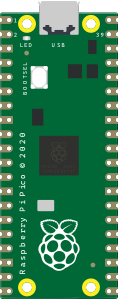
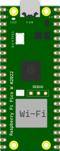

# RP2040 Emulation (Raspberry Pi Pico / Pico W)

> Status: **Functional** · In-browser emulation · No backend dependencies
> Engine: **rp2040js** — ARM Cortex-M0+ emulator in TypeScript
> Platform: **RP2040 @ 125 MHz** — dual-core ARM Cortex-M0+ (single core emulated)
> Available on: all platforms (Windows, macOS, Linux, Docker)
> Applies to: **Raspberry Pi Pico**, **Raspberry Pi Pico W**

---

## Table of Contents

1. [Overview](#1-overview)
2. [Supported Boards](#2-supported-boards)
3. [Emulator Architecture](#3-emulator-architecture)
4. [Emulated Memory and Peripherals](#4-emulated-memory-and-peripherals)
5. [Full Flow: Compile and Run](#5-full-flow-compile-and-run)
6. [Binary Format and Loading](#6-binary-format-and-loading)
7. [GPIO](#7-gpio)
8. [UART — Serial Monitor](#8-uart--serial-monitor)
9. [ADC — Analog Inputs](#9-adc--analog-inputs)
10. [I2C Virtual Devices](#10-i2c-virtual-devices)
11. [SPI](#11-spi)
12. [PWM](#12-pwm)
13. [Simulation Execution Loop](#13-simulation-execution-loop)
14. [Pin Mapping](#14-pin-mapping)
15. [Oscilloscope / Logic Analyzer](#15-oscilloscope--logic-analyzer)
16. [Known Limitations](#16-known-limitations)
17. [Tests](#17-tests)
18. [Differences vs Other Emulators](#18-differences-vs-other-emulators)
19. [Key Files](#19-key-files)

---

## 1. Overview

The **Raspberry Pi Pico** and **Pico W** boards use the **RP2040** microcontroller — a dual-core **ARM Cortex-M0+** chip designed by Raspberry Pi. Unlike the ESP32 (which requires QEMU running in the backend), RP2040 emulation runs **entirely in the browser** using the [rp2040js](https://github.com/wokwi/rp2040js) library (a local clone in `wokwi-libs/rp2040js/`).

### Emulation Engine Comparison

| Board | CPU | Engine |
| ----- | --- | ------ |
| Arduino Uno / Nano / Mega | AVR ATmega | avr8js (browser) |
| Raspberry Pi Pico / Pico W | RP2040 ARM Cortex-M0+ | **rp2040js (browser, no backend)** |
| ESP32-C3, XIAO-C3 | RISC-V RV32IMC | RiscVCore.ts (browser) |
| ESP32, ESP32-S3 | Xtensa LX6/LX7 | QEMU lcgamboa (backend WebSocket) |

### Advantages of the In-Browser Emulator

- **No network dependencies** — works offline, no WebSocket connection to any backend process
- **Instant startup** — emulation begins immediately after compilation (no process launch latency)
- **Testable with Vitest** — the same TypeScript code runs in both production and CI tests
- **Cross-platform** — identical behavior on Windows, macOS, Linux, and Docker

---

## 2. Supported Boards

<table>
<tr>
  <td align="center"><br/><b>Raspberry Pi Pico</b></td>
  <td align="center"><br/><b>Raspberry Pi Pico W</b></td>
</tr>
</table>

| Board | arduino-cli FQBN | Built-in LED | Notes |
| ----- | ---------------- | ------------ | ----- |
| Raspberry Pi Pico | `rp2040:rp2040:rpipico` | GPIO 25 | Standard Pico |
| Raspberry Pi Pico W | `rp2040:rp2040:rpipicow` | GPIO 25 (via CYW43) | WiFi chip not emulated |

> **Pico W note:** The wireless chip (Infineon CYW43439) is not emulated. GPIO 25 drives the on-board LED in the same way as the standard Pico for simulation purposes.

---

## 3. Emulator Architecture

```text
Arduino Sketch (.ino)
        │
        ▼  arduino-cli (backend, FQBN rp2040:rp2040:rpipico)
  sketch.ino.bin  ←  raw ARM binary (no HEX format)
        │
        ▼  base64 → frontend
  compileBoardProgram(boardId, base64)
        │
        ▼  RP2040Simulator.loadBinary(base64)
  Uint8Array → copied into rp2040.flash at offset 0
        │
        ▼  rp2040.loadBootrom(bootromB1)
  Bootrom B1 revision loaded
        │
        ▼  PC reset to 0x10000000 (FLASH_START_ADDRESS)
  CortexM0Core.executeInstruction()  ←  requestAnimationFrame @ 60 FPS
        │                                2,083,333 cycles/frame (125 MHz ÷ 60)
        ├── GPIO listener → PinManager → visual component update
        ├── UART0/UART1 byte → onSerialData → Serial Monitor
        ├── ADC channel read → channelValues[ch] → analogRead()
        └── I2C bus events → virtual I2C device callbacks
```

### Main Classes

| Class | File | Responsibility |
| ----- | ---- | -------------- |
| `RP2040Simulator` | `simulation/RP2040Simulator.ts` | Main wrapper: bootrom, GPIO, UART, ADC, I2C, SPI, RAF loop |
| `RP2040` | `rp2040js` (library) | Full hardware model: CPU, peripherals, memory map |
| `CortexM0Core` | `rp2040js` (library) | ARM Cortex-M0+ instruction decoder and executor |
| `PinManager` | `simulation/PinManager.ts` | Routes GPIO events to visual components |

---

## 4. Emulated Memory and Peripherals

### Memory Map

| Region | Base Address | Size | Description |
| ------ | ------------ | ---- | ----------- |
| Flash (XIP) | `0x10000000` | 16 MB | Program storage (firmware binary) |
| SRAM | `0x20000000` | 264 KB | Data RAM (stack, variables) |
| USB DPRAM | `0x50100000` | 4 KB | USB dual-port RAM |
| Bootrom | `0x00000000` | 4 KB | B1 revision bootrom |

### Peripherals Emulated by rp2040js

| Peripheral | Details |
| ---------- | ------- |
| GPIO | All 30 pins (GPIO0–GPIO29), input/output |
| UART0 | TX/RX, baud rate auto-detection |
| UART1 | TX/RX, forwarded to same `onSerialData` callback |
| I2C0 | Master mode, virtual device callbacks |
| I2C1 | Master mode, virtual device callbacks |
| SPI0 | Default loopback; custom handler supported |
| SPI1 | Default loopback; custom handler supported |
| ADC | 5 channels (GPIO26–29 + internal temp sensor, ch4) |
| PWM | Available on any GPIO |
| Timers | Used internally for `delay()`, `millis()` |
| Watchdog | Present (reads return 0) |
| PLL / Clock | Simulated at fixed 125 MHz |

### Peripherals NOT Emulated

- **WiFi/BLE** (Pico W: CYW43439 wireless chip)
- **USB device stack** (USB device enumeration)
- **DMA transfers** (DMA control registers return 0)
- **PIO state machines** (PIO registers return 0)

> PIO in particular is a significant limitation — `PicoLED`, `WS2812` (NeoPixel), `DHT`, and other timing-critical libraries that rely on PIO will not function.

---

## 5. Full Flow: Compile and Run

### 5.1 Compile the Sketch

The backend compiles for the Pico using the earlephilhower arduino-pico core:

```bash
# First-time setup — install the RP2040 board manager:
arduino-cli config add board_manager.additional_urls \
  https://github.com/earlephilhower/arduino-pico/releases/download/global/package_rp2040_index.json

arduino-cli core install rp2040:rp2040

# Compile for Raspberry Pi Pico:
arduino-cli compile \
  --fqbn rp2040:rp2040:rpipico \
  --output-dir build/ \
  my_sketch/

# Output: build/my_sketch.ino.bin  ← raw binary
```

The Velxio backend automatically finds `sketch.ino.bin` (or `sketch.ino.uf2` as fallback), encodes it as base64, and sends it to the frontend in `CompileResponse.binary_content`.

### 5.2 Serial Redirection (Important)

The backend **automatically prepends** `#define Serial Serial1` to `sketch.ino` for RP2040 boards:

```python
# backend/app/services/arduino_cli.py
if "rp2040" in board_fqbn and write_name == "sketch.ino":
    content = "#define Serial Serial1\n" + content
```

**Why?** The RP2040 bootrom uses UART0 for its own communication. To avoid conflicts, the Arduino `Serial` object is remapped to UART1. This means `Serial.print()` in your sketch goes through UART1, which the emulator also captures and shows in the Serial Monitor.

### 5.3 Minimal Sketch for Raspberry Pi Pico

```cpp
// Blink the built-in LED (GPIO 25)
void setup() {
  pinMode(LED_BUILTIN, OUTPUT);
  Serial.begin(115200);
  Serial.println("Pico started!");
}

void loop() {
  digitalWrite(LED_BUILTIN, HIGH);
  Serial.println("LED ON");
  delay(500);
  digitalWrite(LED_BUILTIN, LOW);
  Serial.println("LED OFF");
  delay(500);
}
```

### 5.4 Analog Read Example

```cpp
// Read a potentiometer on GPIO 26 (ADC channel 0)
void setup() {
  Serial.begin(115200);
}

void loop() {
  int raw = analogRead(A0);       // GPIO26 → ADC ch0, returns 0–4095
  float voltage = raw * 3.3f / 4095.0f;
  Serial.print("ADC: ");
  Serial.print(raw);
  Serial.print(" → ");
  Serial.print(voltage);
  Serial.println(" V");
  delay(200);
}
```

---

## 6. Binary Format and Loading

The RP2040 uses a **raw binary format** (`.bin`), not the Intel HEX format used by AVR:

```typescript
// RP2040Simulator.loadBinary(base64: string)
loadBinary(base64: string): void {
  const binary = Uint8Array.from(atob(base64), c => c.charCodeAt(0));
  // Copy directly into flash at offset 0
  this.rp2040.flash.set(binary, 0);
  // Load bootrom and reset PC to 0x10000000
  this.rp2040.loadBootrom(bootromB1);
}
```

**Flash memory layout** (as seen by the CPU):

```text
0x10000000  ← FLASH_START_ADDRESS — firmware entry point (PC reset here)
0x10000100  ...  program .text section
0x10xxxxxx  ...  .rodata, .data, constants
0x20000000  ← SRAM — stack, heap, .bss
```

The bootrom B1 (`rp2040-bootrom.ts`) contains the RP2040's factory-programmed ROM code, required for correct flash XIP (eXecute In Place) initialization.

---

## 7. GPIO

All 30 GPIO pins (GPIO0–GPIO29) are emulated. Each pin has an event listener attached at startup:

```typescript
// RP2040Simulator.ts — gpio listener setup
for (let gpioIdx = 0; gpioIdx < 30; gpioIdx++) {
  const gpio = this.rp2040.gpio[gpioIdx];
  gpio.addListener((state: GPIOPinState) => {
    const isHigh = state === GPIOPinState.High;
    this.pinManager.triggerPinChange(gpioIdx, isHigh);
    if (this.onPinChangeWithTime) {
      const timeMs = this.rp2040.clock.timeUs / 1000;
      this.onPinChangeWithTime(gpioIdx, isHigh, timeMs);
    }
  });
}
```

### GPIO Input (Push Buttons / Switches)

External components can drive GPIO pins from the UI:

```typescript
// Set a pin HIGH or LOW from the simulator canvas (e.g. button press)
simulator.setPinState(gpioPin: number, state: boolean): void
// → rp2040.gpio[gpioPin].setInputValue(state)
```

This is equivalent to the signal propagated by a physical wire from a button to the GPIO pin.

### LED_BUILTIN

- `LED_BUILTIN` = GPIO 25 on both Pico and Pico W
- A pin change listener on GPIO 25 drives the on-board LED component
- `digitalWrite(LED_BUILTIN, HIGH)` → GPIO 25 goes high → LED visual component turns on

---

## 8. UART — Serial Monitor

The RP2040 has two UART controllers. Both are emulated and forwarded to the Serial Monitor:

| Channel | TX Pin | RX Pin | Arduino Object | Notes |
| ------- | ------ | ------ | -------------- | ----- |
| UART0 | GPIO0 | GPIO1 | `Serial1` | Used by bootrom; Arduino `Serial` redirected away |
| UART1 | GPIO4 | GPIO5 | `Serial` (redirected) | Receives Arduino `Serial.print()` |

### Serial Output (TX → Monitor)

```typescript
// Both UART0 and UART1 forward bytes to the same callback:
this.rp2040.uart[0].onByte = (value: number) => {
  this.onSerialData?.(String.fromCharCode(value));
};
this.rp2040.uart[1].onByte = (value: number) => {
  this.onSerialData?.(String.fromCharCode(value));
};
```

### Serial Input (Monitor → Sketch)

```typescript
// Feed text from the Serial Monitor input box into the sketch:
simulator.serialWrite("COMMAND\n");
// → bytes queued in rp2040.uart[0].feedByte(charCode)
// → sketch reads them via Serial.read() / Serial.readString()
```

---

## 9. ADC — Analog Inputs

The RP2040 has a 12-bit ADC (0–4095) with 5 channels:

| ADC Channel | GPIO Pin | Arduino Alias | Default Value | Notes |
| ----------- | -------- | ------------- | ------------- | ----- |
| 0 | GPIO26 | A0 | 2048 (~1.65 V) | General purpose |
| 1 | GPIO27 | A1 | 2048 (~1.65 V) | General purpose |
| 2 | GPIO28 | A2 | 2048 (~1.65 V) | General purpose |
| 3 | GPIO29 | A3 | 2048 (~1.65 V) | General purpose |
| 4 | — (internal) | — | 876 (~27 °C) | Internal temperature sensor |

### Injecting ADC Values from UI Components

When a potentiometer is wired to an ADC pin on the canvas, the simulator canvas reads the potentiometer's value and injects it:

```typescript
// SimulatorCanvas — potentiometer input event
simulator.setADCValue(channel: number, value: number): void
// value range: 0–4095 (clamped automatically)
// → rp2040.adc.channelValues[channel] = value
```

`analogRead(A0)` in the sketch reads `adc.channelValues[0]` directly.

---

## 10. I2C Virtual Devices

The RP2040 emulator supports virtual I2C devices — software objects that respond to I2C bus transactions from the firmware:

```typescript
export interface RP2040I2CDevice {
  address: number;     // 7-bit I2C address
  writeByte(value: number): boolean;  // return true = ACK
  readByte(): number;
  stop?(): void;
}
```

### Default Virtual Devices (Auto-Registered)

Three virtual I2C devices are registered automatically when a Pico program is loaded:

| Device | Address | Bus | Description |
| ------ | ------- | --- | ----------- |
| `VirtualDS1307` | 0x68 | I2C0 | Real-time clock (DS1307 compatible) |
| `VirtualTempSensor` | 0x48 | I2C0 | Temperature sensor (LM75 / TMP102 compatible) |
| `I2CMemoryDevice` | 0x50 | I2C0 | 24C04 EEPROM (512 bytes) |

### Default I2C0 Pins

| Signal | GPIO |
| ------ | ---- |
| SDA | GPIO4 |
| SCL | GPIO5 |

### I2C Bus Event Flow

```text
firmware: Wire.beginTransmission(0x68)
        │
        ▼  I2C master asserts START + address
  rp2040.i2c[0].onConnect(address=0x68)
        │
        ▼  device found in registry
  ds1307.writeByte(register_address)
        │
  Wire.requestFrom(0x68, 7)
        │
        ▼  7 read calls
  ds1307.readByte() × 7
        │
        ▼  I2C STOP
  ds1307.stop()
```

---

## 11. SPI

Both SPI buses implement a **loopback** by default — bytes transmitted by the master are immediately echoed back as received bytes:

```typescript
// Default: loopback
this.rp2040.spi[0].onTransmit = (value: number) => {
  this.rp2040.spi[0].completeTransmit(value);
};
```

### Default SPI0 Pins

| Signal | GPIO |
| ------ | ---- |
| MISO | GPIO16 |
| CS | GPIO17 |
| SCK | GPIO18 |
| MOSI | GPIO19 |

### Custom SPI Handler

A custom handler can replace the loopback for simulating specific SPI peripherals (displays, sensors):

```typescript
simulator.setSPIHandler(bus: 0 | 1, handler: (value: number) => number): void
// handler receives TX byte, returns RX byte
```

---

## 12. PWM

PWM is available on any GPIO pin through the RP2040's hardware PWM slices. The rp2040js library emulates the PWM peripheral registers, so `analogWrite()` and `ledcWrite()` work at the firmware level.

Visual PWM feedback (LED dimming) in the simulator canvas uses the `onPwmChange` callback from `PinManager`, which receives the duty cycle as a 0.0–1.0 float and sets `el.style.opacity` on the LED element.

---

## 13. Simulation Execution Loop

The simulation runs at **60 FPS** using `requestAnimationFrame`. Each frame executes enough CPU cycles to match a 125 MHz clock:

```
F_CPU            = 125,000,000 Hz
CYCLE_NANOS      = 1e9 / F_CPU  = 8 ns/cycle
CYCLES_PER_FRAME = F_CPU / 60   = 2,083,333 cycles/frame
```

### WFI Optimization

When the ARM core executes a **WFI** (Wait For Interrupt) instruction — which Arduino uses during `delay()` and `sleep()` — the loop skips ahead to the next pending timer alarm instead of executing millions of NOP-equivalent cycles:

```typescript
while (cyclesDone < cyclesTarget) {
  if (core.waiting) {
    // CPU is sleeping — jump to next alarm
    const jump = clock.nanosToNextAlarm;
    if (jump <= 0) break;
    clock.tick(jump);
    cyclesDone += Math.ceil(jump / CYCLE_NANOS);
  } else {
    // Execute one ARM instruction
    const cycles = core.executeInstruction();
    clock.tick(cycles * CYCLE_NANOS);
    cyclesDone += cycles;
  }
}
```

This allows `delay(1000)` to complete in microseconds of real time instead of simulating all 125 million cycles.

### Variable Speed

The simulation speed can be adjusted:

```typescript
simulator.setSpeed(speed: number): void
// speed: 0.1 (10% = very slow, for debugging) to 10.0 (10× faster)
```

---

## 14. Pin Mapping

The Pico has 40 physical pins. Below is the mapping from board pin names to GPIO numbers:

| Board Pin | GPIO | Function | Board Pin | GPIO | Function |
| --------- | ---- | -------- | --------- | ---- | -------- |
| GP0 | 0 | UART0 TX | GP15 | 15 | SPI1 TX |
| GP1 | 1 | UART0 RX | GP16 | 16 | SPI0 MISO |
| GP2 | 2 | I2C1 SDA | GP17 | 17 | SPI0 CS |
| GP3 | 3 | I2C1 SCL | GP18 | 18 | SPI0 SCK |
| GP4 | 4 | I2C0 SDA | GP19 | 19 | SPI0 MOSI |
| GP5 | 5 | I2C0 SCL | GP20 | 20 | — |
| GP6 | 6 | SPI0 SCK | GP21 | 21 | — |
| GP7 | 7 | SPI0 TX | GP22 | 22 | — |
| GP8 | 8 | UART1 TX | GP26 | 26 | ADC ch0 (A0) |
| GP9 | 9 | UART1 RX | GP27 | 27 | ADC ch1 (A1) |
| GP10 | 10 | SPI1 SCK | GP28 | 28 | ADC ch2 (A2) |
| GP11 | 11 | SPI1 TX | GP29 | 29 | ADC ch3 (A3) |
| GP12 | 12 | SPI1 RX | **GP25** | **25** | **LED_BUILTIN** |
| GP13 | 13 | SPI1 CS | — | — | VBUS, VSYS, 3V3, GND |
| GP14 | 14 | SPI1 SCK | — | — | RUN, ADC_VREF |

> All GPIO pins support PWM. GPIO 0–22 and 26–29 are available for general-purpose digital I/O. GPIO 23–25 are internal (power control, LED, SMPS mode).

---

## 15. Oscilloscope / Logic Analyzer

The RP2040 emulator provides timestamps for every GPIO transition using the internal simulation clock:

```typescript
// Callback fires on every GPIO state change
simulator.onPinChangeWithTime = (pin: number, state: boolean, timeMs: number) => {
  // timeMs = rp2040.clock.timeUs / 1000
  // Accurate to ~8 ns (one ARM clock cycle)
};
```

The oscilloscope store (`useOscilloscopeStore`) subscribes to this callback and records samples:

```text
GPIO event fired (pin=25, state=HIGH, timeMs=123.456)
        │
        ▼
useOscilloscopeStore.pushSample(channelId, 123.456, true)
        │
        ▼
Oscilloscope waveform display updates
```

This enables the built-in logic analyzer to display accurate waveforms for signals like PWM, UART bit patterns, and I2C clock/data.

---

## 16. Known Limitations

| Limitation | Detail |
| ---------- | ------ |
| Single-core only | RP2040 is dual-core; emulator runs core 0 only. Code that uses `multicore_launch_core1()` will not execute on core 1 |
| No PIO | PIO state machines return 0. Libraries that depend on PIO (WS2812 NeoPixels, DHT sensors, I2S audio, quadrature encoders) will not work |
| No WiFi (Pico W) | The CYW43439 wireless chip is not emulated; `WiFi.begin()` will not connect |
| No USB device | USB HID, CDC, and MIDI device modes are not emulated |
| No DMA | DMA transfers return without moving data; memcpy-based alternatives work fine |
| No hardware FPU | ARM Cortex-M0+ has no floating-point unit; float operations are emulated in software (slower, but correct) |
| Timing accuracy | Emulation runs at variable speed; `micros()` and `millis()` track simulated time, not wall-clock time |
| Flash writes | `LittleFS`, `EEPROM.commit()`, and other flash-write operations may not persist across simulated resets |
| Serial redirect | `Serial` is mapped to `Serial1` (UART1) at compile time; code that uses `Serial1` directly alongside `Serial` may behave unexpectedly |

---

## 17. Tests

RP2040 emulation tests are in `frontend/src/__tests__/`:

```bash
cd frontend
npm test -- RP2040
```

### Test Suites

| Suite | Tests | What It Verifies |
| ----- | ----- | ---------------- |
| Lifecycle | 4 | `create`, `loadBinary`, `start`, `stop`, `reset` idempotency |
| GPIO | 8 | All 30 pins, state injection, listener callbacks, multiple listeners |
| ADC | 3 | Channel access (0–4), value clamping to 0–4095, `analogRead` integration |
| Serial | 4 | `onSerialData` callback, `serialWrite` input feed, both UART channels |
| I2C | 5 | Virtual device registration, address matching, read/write/stop callbacks |
| SPI | 2 | Custom handler registration, loopback default |
| Bootrom | 1 | Loads without errors, PC resets to `0x10000000` |

---

## 18. Differences vs Other Emulators

| Aspect | Raspberry Pi Pico (RP2040) | Arduino AVR | ESP32-C3 (RISC-V) | ESP32 (Xtensa) |
| ------ | -------------------------- | ----------- | ------------------ | -------------- |
| Engine | `rp2040js` (browser) | `avr8js` (browser) | `RiscVCore.ts` (browser) | QEMU backend (WebSocket) |
| Backend dependency | **No** | **No** | **No** | Yes |
| Architecture | ARM Cortex-M0+ | AVR 8-bit | RISC-V RV32IMC | Xtensa LX6 |
| Clock speed | 125 MHz | 16 MHz | 160 MHz | 240 MHz |
| Binary format | `.bin` (raw) | `.hex` (Intel HEX) | `.bin` (merged flash) | `.bin` (merged flash) |
| Arduino framework | Full | Full | Partial (no FreeRTOS) | Full |
| Serial | UART0 + UART1 | USART0 | UART0 | UART0 |
| ADC | 4 external + 1 temp | 6 channels (10-bit) | Not emulated | Emulated |
| I2C | 2 buses + virtual devices | Not emulated | Not emulated | Emulated |
| SPI | 2 buses (loopback) | Not emulated | Not emulated | Emulated |
| PIO | **Not emulated** | N/A | N/A | N/A |
| PWM | All GPIO pins | Timer-based | Not emulated | LEDC (mapped) |
| Oscilloscope support | Yes (8 ns resolution) | Yes | Yes | No |
| CI tests | Yes (Vitest) | Yes | Yes | No |

---

## 19. Key Files

| File | Description |
| ---- | ----------- |
| `frontend/src/simulation/RP2040Simulator.ts` | Main emulator wrapper (GPIO, UART, ADC, I2C, SPI, RAF loop) |
| `frontend/src/simulation/rp2040-bootrom.ts` | RP2040 B1 bootrom binary (required for flash XIP) |
| `frontend/src/simulation/PinManager.ts` | Routes GPIO events to visual components on canvas |
| `frontend/src/store/useSimulatorStore.ts` | Zustand store — `compileBoardProgram()`, `startBoard()`, serial wiring |
| `frontend/src/components/simulator/SimulatorCanvas.tsx` | Canvas rendering, pin subscriptions, ADC/button event forwarding |
| `frontend/src/components/components-wokwi/PiPicoWElement.ts` | Pico W SVG board rendering and pin coordinate map |
| `frontend/src/__tests__/RP2040Simulator.test.ts` | Unit and integration tests |
| `backend/app/services/arduino_cli.py` | Compilation — detects RP2040 FQBN, encodes `.bin` as base64, prepends `Serial1` redirect |
| `wokwi-libs/rp2040js/` | Local clone of the rp2040js library (ARM Cortex-M0+ emulator) |
